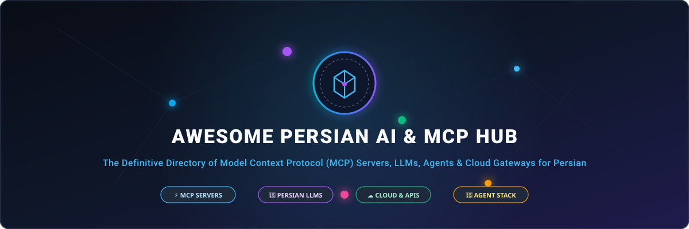

# نسخه فارسی Awesome Persian AI Hub

 

 

**مرکز جامع، مهندسی‌شده و یکپارچه ابزارها، پروتکل MCP، مدل‌های زبانی، سرویس‌های ابری و زیرساخت‌های هوش مصنوعی برای زبان فارسی و ایران.**

[نسخه انگلیسی (English Version)](README.md) • [راهنمای مشارکت](CONTRIBUTING.md) • [گزارش خطا یا ثبت ابزار](https://github.com/Kalahamoon/awesome-persian-ai/issues)

---

### 🇮🇷 درود و سپاس از پیشگامان هوش مصنوعی فارسی

> **پیام تقدیر و افتخار:**  
> صمیمانه‌ترین درودها و تبریکات نثار تمامی دانشمندان، مهندسان نرم‌افزار، پژوهشگران هوش مصنوعی، فعالان جامعه متن‌باز و کارآفرینان ایرانی در سراسر کره زمین — از مراکز تحقیقاتی پیشرو در اروپا و آمریکای شمالی تا استارتاپ‌ها، شرکت‌های دانش‌بنیان و توسعه‌دهندگان مستقل در جای‌جای ایران عزیز — که با وجود پیچیده‌ترین شرایط تحریمی، موانع زیرساختی و نابرابری‌های دسترسی، هرگز متوقف نشدند و با پشتکار، ایثار علمی و خلاقیت ناب خود، جایگاه زبان، فرهنگ و هوش مصنوعی فارسی را در صدر تحولات جهانی پاس داشتند. این هاب تقدیم به تک‌تک شما همراهان سرافراز است. 🦁✨

---

## 🧭 فهرست دسته‌بندی‌ها

| شماره | عنوان بخش | خلاصه محتوا |
| :---: | :--- | :--- |
| **۰۱** | [🔌 سرورها و ابزارهای پروتکل MCP](#۱-سرورها-و-ابزارهای-پروتکل-mcp) | سرورهای MCP برای پلتفرم‌های ایرانی، پیام‌رسان‌ها و اتوماسیون‌های سازمانی |
| **۰۲** | [☁️ پلتفرم‌های ابری و درگاه‌های API](#۲-پلتفرمهای-ابری-و-درگاههای-api) | درگاه‌های بدون تحریم، فروش توکنی و سرورهای GPU |
| **۰۳** | [🧠 مدل‌های زبانی و بنیادی فارسی](#۳-مدلهای-زبانی-و-بنیادی-فارسی) | مدل‌های متن‌باز پایه، وزن‌های زبانی و لیدربوردهای رسمی |
| **۰۴** | [🤖 سیستم‌ها و فریم‌ورک‌های چندایجنتیک](#۴-سیستمها-و-فریمورکهای-چندایجنتیک) | عامل‌های خودمختار، تبدیل متن به SQL و منشی‌های صوتی تلفنی |
| **۰۵** | [🛡️ امنیت مدل‌های زبانی، گاردریل و ایمنی پرامپت](#۵-امنیت-مدلهای-زبانی-گاردریل-و-ایمنی-پرامپت) | دیواره‌های آتش زبانی، آزمون نفوذ پرامپت و جلوگیری از جیل‌بریک |
| **۰۶** | [⚖️🩺 هوش مصنوعی در حوزه‌های تخصصی](#۶-هوش-مصنوعی-در-حوزههای-تخصصی-حقوقی-و-سلامت) | سیستم‌عامل دفاتر وکالت، مدل‌های بالینی پزشکی و شبیه‌سازها |
| **۰۷** | [🎙️ پردازش گفتار، صوت و دوبله](#۷-پردازش-گفتار-صوت-و-دوبله) | بازشناسی گفتار فارسی (STT)، سنتز گفتار و شبیه‌سازی صدا (TTS) |
| **۰۸** | [👁️ بینایی ماشین و مدل‌های چندوجهی](#۸-بینایی-ماشین-و-مدلهای-چندوجهی) | مدل‌های چندوجهی فارسی (CLIP)، موتورهای OCR و تبدیل به LaTeX |
| **۰۹** | [📚 ابزارهای بازیابی اطلاعات و RAG بومی](#۹-ابزارهای-بازیابی-اطلاعات-و-rag-بومی) | مدل‌های برداری امبدینگ و پایپ‌لاین‌های سازمانی پرسش‌وپاسخ اسناد |
| **۱۰** | [🛠️ کتابخانه‌ها و ابزارهای مهندسی زبان](#۱۰-کتابخانهها-و-ابزارهای-مهندسی-زبان) | نرمال‌سازها، واژه‌نماها، جعبه‌ابزارهای توکنایزیشن و رسم‌الخط |
| **۱۱** | [🌐 ترجمه ماشینی و ترنسفر زبان](#۱۱-ترجمه-ماشینی-و-ترنسفر-زبان) | مدل‌های ترجمه عصبی دوطرفه و مترجم‌های فرمت کتاب الکترونیکی |
| **۱۲** | [🖥️ افزونه‌ها، ابزارهای مرورگر و محیط‌های توسعه](#۱۲-افزونهها-ابزارهای-مرورگر-و-محیطهای-توسعه) | افزونه‌های تصحیح راست‌چین VS Code، ترمینال‌های BiDi و چیدمان متن |
| **۱۳** | [📊 دیتاست‌ها و منابع ارزیابی داده](#۱۳-دیتاستها-و-منابع-ارزیابی-داده) | پیکره‌های ۸۰ گیگابایتی آموزش اولیه، دیتاست‌های دستوری و صوتی |

---

## 🏷️ راهنمای برچسب‌ها و وضعیت‌ها

| نشان بصری | عنوان و دسته‌بندی فنی |
| :--- | :--- |
|  | **پروتکل اتصال مدل:** ارائه ابزارها و منابع استاندارد برای ایجنت‌های هوش مصنوعی |
|  | **متن‌باز:** سورس‌کد یا وزن‌های مدل به‌صورت عمومی در گیت‌هاب یا هاگینگ‌فیس در دسترس است |
|  | **درگاه API:** سرویس تجمیعی ارائه توکن با پرداخت ریالی/تومانی |
|  | **عامل هوشمند:** سیستم دارای حلقه تصمیم‌گیری و اجرای وظایف چندمرحله‌ای |
|  | **لیدربورد و ارزیابی:** جداول رتبه‌بندی رقابتی و بنچ‌مارک‌های معتبر |
|  | **امنیت و گاردریل:** ابزارهای آزمون نفوذ، ایمنی پرامپت و دیواره‌های آتش زبانی |
|   | **حوزه تخصصی:** مدل‌ها و سامانه‌های اختصاصی حقوقی، قضایی یا سلامت و پزشکی |
|  | **بدون تحریم‌شکن:** دسترسی مستقیم بدون نیاز به VPN از داخل ایران |
|  | **اینترانت ملی:** پایداری تضمین‌شده در شرایط محدودیت اینترنت بین‌الملل |
|   | **مدل هزینه:** بسته‌های اعتباری/مصرفی یا قراردادهای سازمانی |

---

## ۱. سرورها و ابزارهای پروتکل MCP

### ۱.۱. پلتفرم‌های تجارت الکترونیک و آگهی ایران
* **[Basalam MCP Server](https://developers.basalam.com/docs/mcp)**   — سرور رسمی MCP بازار اجتماعی باسلام در آدرس `mcp.basalam.com/mcp` جهت جستجوی محصولات و مدیریت سفارش‌ها.
* **[Digikala MCP Server](https://github.com/mmdju/digikala-mcp)**   — سرور MCP مستقل دیجی‌کالا با ۱۶ ابزار اختصاصی جستجو، مقایسه قیمت و استخراج مشخصات فنی.
* **[Divar MCP Server](https://github.com/mmdju/divar-mcp)**   — سرور MCP جستجو و تحلیل آگهی‌های پلتفرم دیوار (املاک، خودرو، کالا).
* **[Torob MCP Server](https://github.com/mmdju/torob-mcp)**   — سرور MCP موتور مقایسه قیمت ترب شامل ۱۴ ابزار برای پایش تخفیف‌ها و نوسان قیمت.

### ۱.۲. سامانه‌های اتوماسیون، پیام‌رسان‌ها و زیرساخت
* **Kasra MCP Server**   — اتصال هوش مصنوعی به اتوماسیون تردد و پرسنلی کسرا برای ثبت مرخصی، مأموریت و مشاهده کارکرد.
* **Bale Messenger MCP**   — اتصال ایجنت‌های هوش مصنوعی به پیام‌رسان بله برای خواندن تاریخچه و ارسال پیام تاییدمحور.
* **[Liara Cloud MCP Server](https://github.com/SalehB1/Lira-mcp)**   — سرور MCP بر روی مستندات و زیرساخت ابری لیارا جهت دیباگ لاگ‌های بیلد و کانفیگ استقرار.
* **[Aira MCP Server](https://github.com/AiraChat/aira-mcp)**   — سرور MCP و رجیستری کانکتورهای شناختی هوش مصنوعی فارسی.
* **[Hermes Agent Iran Gateway](https://github.com/hnkwing/hermes-agent-iran-gateway)**   — گیت‌وی متن‌باز اتصال ایجنت هرمس به پیام‌رسان‌های بومی بله و روبیکا.
* **[Smart Home KNX MCP](https://github.com/SMousavi7/smart-home-knx-thingsboard)**   — کنترل سیستم خانه هوشمند با فرمان‌های زبان طبیعی فارسی از طریق ترکیب KNX و اولاما.
* **[APIs-made-in-Iran Catalog](https://github.com/Hameds/APIs-made-in-Iran)**   — کاتالوگ جامع صدها وب‌سرویس عمومی و سازمانی در ایران.

### ۱.۳. ابزارهای زمانی، تقویم و بازارهای مالی ایران
* **[Jalali Date Engine](https://persian-calendar.ir/)**  — موتور دقیق تبدیل تقویم‌های شمسی، میلادی و قمری و استخراج تعطیلات رسمی ایران.
* **[TGJU Live Market Feed](https://marketplace.tgju.org)**  — وب‌سرویس استخراج لحظه‌ای نرخ ارز، طلا، سکه و بورس برای ایجنت‌های مالی.
* **[Nobitex Trading Agent Tool](https://apidocs.nobitex.ir/)**  — واسط برنامه‌نویسی بازار رمزارز نوبیتکس برای تحلیل عمق بازار و قیمت تتر.

---

## ۲. پلتفرم‌های ابری و درگاه‌های API

### ۲.۱. درگاه‌های تجمیعی و ارائه‌دهنده توکن بدون تحریم
* **[AIZamin (ای‌آی زمین)](https://aizamin.ir)**    — فروش توکنی و حجمی بدون اشتراک ماهانه؛ سازگاری با OpenCode و VS Code با پرداخت تومان.
* **[متیس (Metis AI)](https://www.metisai.ir)**    — پایدار در زمان قطعی اینترنت بین‌الملل، سیستم No-Code و کش توکن و حافظه RAG بومی.
* **[AvalAI (اول‌آی)](https://avalai.ir)**    — درگاه پرسرعت سازگار با SDK پایتون/JS اوپن‌ای‌آی با پرداخت ریالی.
* **[پارت دات آی‌آر (Part AI)](https://partsoftware.com)**   — بزرگ‌ترین اکوسیستم هوش مصنوعی بومی ایران (درنا، سهاب، پردازش تصویر و صوت بانکی).
* **[هوشیو (Hooshio)](https://hooshio.com)**   — پایگاه دانش و ارائه‌دهنده راهکارهای شرکتی و اشتراک مدل‌های هوش مصنوعی.
* **[مه‌پرتو (Mehparto)](https://mehparto.ir)**   — خدمات زیرساختی LLM و مدل‌های سفارشی برای سازمان‌ها.

### ۲.۲. زیرساخت‌های ابری پردازش هوش مصنوعی و GPU
* **[ابر آروان (ArvanCloud AI / GPU IaaS)](https://arvancloud.ir)**  — سرورهای ابری مجهز به پردازنده‌های گرافیکی NVIDIA در شبکه ملی.
* **[ابر دراک (Derak Cloud)](https://derak.cloud)**  — خدمات ابری لبه و ذخیره‌سازی داده‌های برداری (Vector DBs).

---

## ۳. مدل‌های زبانی و بنیادی فارسی

### ۳.۱. مدل‌های متن‌باز و وزن‌های زبانی
* **درنا ۲ (Dorna 2)**   — نسل دوم مدل زبانی درنا بر پایه LLaMA-3.1 با حجم 8B و پشتیبانی از GGUF.
* **مرال (Maral-7B)**   — مدل پایه محبوب فارسی بر پایه Mistral-7B با درک بالا از متون فارسی.
* **PersianMind (دانشگاه تهران)**   — مدل زبانی دانشگاه تهران برای استدلال علمی و ادبی فارسی.
* **سینا (Sina-LLM)**   — مدل فاین‌تیون‌شده روی پیکره‌های بزرگ فارسی مبتنی بر LLaMA-3.
* **AVA-Llama-3 & Mistral**   — سری مدل‌های زبانی آوا با کیفیت روان در مکالمه.
* **ParsBERT**   — مدل بنیادین ترانسفورمر زبان فارسی با بیش از ۱۶۰ هزار دانلود در هاگینگ‌فیس.
* **ParsGPT**   — مدل تولید متن و مکالمه بر پایه معماری GPT-2 در هوشواره.
* **Gemma-3-Persian**   — فاین‌تیون دقیق بر روی نسل جدید مدل‌های سبک جما گوگل.
* **آوا (Ava-LLM)**   — مدل سبک برای اجرای محلی روی پردازنده معمولی لپ‌تاپ با Ollama.
* **مدل‌های هزار (Hezar)**   — مدل‌های چندمنظوره برای تحلیل احساسات، NER و خلاصه‌سازی.

### ۳.۲. لیدربوردها و بنچ‌مارک‌های ارزیابی
* **[Open Persian LLM Leaderboard (PartAI)](https://huggingface.co/spaces/PartAI/open-persian-llm-leaderboard)**  — لیدربورد رسمی و جامع ارزیابی رقابتی مدل‌های زبانی فارسی در هاگینگ‌فیس.
* **[persian-llm-eval](https://github.com/heyparsadev/persian-llm-eval)**  — بنچ‌مارک استاندارد مدل‌های فارسی با ۳۰۰ تست در ۱۰ شاخه تخصصی.
* **[PersianMMLU Benchmark](https://huggingface.co/spaces/raia-center/PersianMMLU)**  — بنچ‌مارک درک دانش دانشگاهی در ۵۷ رشته تخصصی به زبان فارسی.
* **[ParsiEval](https://github.com/mshojaei77/ParsiEval)**  — ارزیابی استدلال، ریاضیات و درک متن در مدل‌های بزرگ زبانی فارسی.
* **[ParsBench](https://github.com/ParsBench/ParsBench)**  — مجموعه ابزار و دیتاست برای ارزیابی تسک‌های زبان فارسی.
* **[TAAROFBENCH](https://github.com/niktaas/TAAROFBENCH)**  — اولین بنچ‌مارک سنجش درک مدل‌ها از تعارف، کنایه و فرهنگ گفتاری ایرانی.

---

## ۴. سیستم‌ها و فریم‌ورک‌های چندایجنتیک
* **[LangGraph Multi-Agent Persian](https://github.com/SaharZarbafi/langgraph-multi-agent-persian)**  — سیستم چندعامله پروداکشن با معماری Actor-Critic و مسیریابی هوشمند میان مدل‌ها.
* **[Local SQL Agent (Persian)](https://github.com/alisadeghiaghili/local-sql-agent)**  — تبدیل امن زبان طبیعی فارسی به دستورات SQL با اعتبارسنجی نحوی AST.
* **[Doctor Agent](https://github.com/SirBNL/doctor-agent)**  — ایجنت نوبت‌دهی پزشکی با ابزارخوانی (Tool Calling) لوکال با اولاما.
* **[Phone Agent (منشی تلفنی هوشمند)](https://github.com/sepehr071/phone-agent)**  — پاسخ‌گویی صوتی خودکار تلفنی بر بستر استریسک (Asterisk) به فارسی روان.
* **[Micky Voice Assistant](https://github.com/xmannii/micky)**  — دستیار صوتی ایجنتیک اولویت‌دار برای زبان فارسی.
* **[Moujez Summarizer Agent](https://github.com/kharazi/moujez)**  — ایجنت تلخیص و عصاره‌کشی ساختاریافته از متون طولانی.

---

## ۵. امنیت مدل‌های زبانی، گاردریل و ایمنی پرامپت
* **[MCI LLM Security Hackathon Archive](https://github.com/erfnzdeh/MCI-LLM-Security-Hackathon)**  — سناریوهای آزمون نفوذ و جیل‌بریک مدل‌های زبانی فارسی از طریق حملات چندزبانه و چارچوب‌بندی.
* **[Persian LLM Security Evaluation](https://github.com/Haniyesabeghi/Persian-LLM-Security-Evaluation-BA)**  — ارزیابی آسیب‌پذیری و دفاع روی مدل‌های درنا و مرال با اولاما.
* **[Morphological Type Guards (MTG)](https://github.com/Moshe-ship/mtg)**  — دفاع در برابر حملات فریب کاراکتری و دستکاری جهت‌گیری متن (BiDi Hijacking).
* **[PAIB Benchmark](https://github.com/Romohub/paib)**  — بنچ‌مارک ارزیابی یکپارچگی ایجنت‌های فارسی در برابر دستکاری دستورات.

---

## ۶. هوش مصنوعی در حوزه‌های تخصصی: حقوقی و سلامت

### ۶.۱. حقوق، قضا و قراردادها
* **[Persian Legal Practice OS](https://github.com/ansariaiadmin/legal-platform)**  — سیستم‌عامل سلف‌هاستد دفاتر وکالت با ۶ ایجنت هوشمند و RAG سه‌گانه.
* **[Persian Legal RAG Agent](https://github.com/Hamidreza-Talei/persian-legal-rag-agent)**  — پاسخگویی به سوالات حقوقی مدنی و کیفری ایران با بازرتبه‌بندی معنایی.
* **[Smart Legal Letterhead](https://github.com/ahmadsalamifar/smart-legal-letterhead)**  — تولیدکننده هوشمند لوایح و سربرگ‌های حقوقی فارسی.

### ۶.۲. پزشکی، داروسازی و سلامت
* **[PerMed (Persian Meditron)](https://github.com/neda-kheirkhah/PerMed)**  — مدل زبانی تخصصی پزشکی و دارویی فارسی مبتنی بر Meditron.
* **[Persian Medical RAG Chatbot](https://github.com/yousef-mousavizade/Persian-Medical-RAG-Chatbot)**  — چت‌بات دارویی و بالینی متصل به دیتابیس‌های پزشکی ایران.
* **[OSCE AI Tutor](https://github.com/NafisSam/osce-tutor)**  — شبیه‌ساز آزمون‌های بالینی OSCE برای دانشجویان پزشکی ایران.

---

## ۷. پردازش گفتار، صوت و دوبله

### ۷.۱. تبدیل گفتار به متن (Speech-to-Text)
* **[wav2vec2-large-xlsr-53-persian](https://huggingface.co/jonatasgrosman/wav2vec2-large-xlsr-53-persian)**  — پردانلودترین مدل تشخیص گفتار فارسی با نزدیک به ۱ میلیون دانلود.
* **[Wav2Vec2 Persian v3 (m3hrdadfi)](https://huggingface.co/m3hrdadfi/wav2vec2-large-xlsr-persian-v3)**  — مدل بهینه‌شده بازشناسی گفتار فارسی با نرخ خطای واژگانی بسیار پایین.
* **[Whisper-Persian-v4 (nezamisafa)](https://huggingface.co/nezamisafa/whisper-persian-v4)**  — مدل بهینه‌شده ویسپر لارج ۳ برای زبان فارسی.
* **[Persian ASR Leaderboard](https://huggingface.co/spaces/navidved/open_persian_asr_leaderboard)**  — لیدربورد مقایسه‌ای عملکرد مدل‌های بازشناسی گفتار فارسی.
* **[PersianScribe for Apple Silicon](https://github.com/duuuude/PersianScribe-for-Apple-Silicon)**  — تبدیل آفلاین گفتار به متن با تفکیک گوینده روی پردازنده‌های سری M اپل.
* **[Nemotron ASR Streaming Farsi](https://huggingface.co/mehdi-hf/nemotron-asr-streaming-farsi)**  — تشخیص گفتار استریمینگ بلادرنگ مبتنی بر معماری نیموترون انویدیا.
* **[فارس‌آوا (FarsAva / Amerandish)](https://amerandish.com)**  — سرویس تجاری باسابقه تبدیل گفتار به متن در محیط‌های شلوغ.
* **[IoType (آی‌او تایپ)](https://www.iotype.com/api)**  — وب‌سرویس تایپ صوتی و تبدیل صوت به متن.

### ۷.۲. تبدیل متن به گفتار و شبیه‌سازی صدا (Text-to-Speech)
* **[Chatterbox-TTS-Persian-Farsi](https://huggingface.co/Thomcles/Chatterbox-TTS-Persian-Farsi)**  — محبوب‌ترین و طبیعی‌ترین مدل تبدیل متن به صوت فارسی.
* **[Pocket TTS Farsi (ONNX)](https://huggingface.co/Nimaone/pocket-tts-farsi-v2-onnx)**  — سنتز گفتار سبک با فرمت ONNX برای دیوایس‌های کم‌مصرف.
* **[persian_tts (nimaone)](https://github.com/nimaone/persian_tts)**  — سنتز صدای فارسی با قابلیت شبیه‌سازی صدا (Voice Cloning) کاملاً آفلاین روی CPU.
* **[Mana Persian Piper](https://huggingface.co/MahtaFetrat/Mana-Persian-Piper)**  — مدل بهینه‌سازی‌شده برای موتور صوت پایپر با تلفظ دقیق.
* **[dcho Voice Engine](https://github.com/AliAkrami1375/dcho)**  — موتور صوتی سبک متن‌باز برای گجت‌ها و سیستم‌های امبدد.
* **[Gooya Bozorg (گویا بزرگ)](https://github.com/Reza2kn/gooya-bozorg-native)**  — برنامه دسکتاپ کراس‌پلتفرم برای خوانش متن‌های طولانی به فارسی روان.

---

## ۸. بینایی ماشین و مدل‌های چندوجهی
* **[CLIPfa (سجاد ایوبی)](https://github.com/sajjjadayobi/CLIPfa)**  — مدل اتصال متن و تصویر در زبان فارسی برای جستجوی متنی تصویر.
* **[Qwen2-VL-Persian-Arabic-OCR](https://huggingface.co/mohajesmaeili/Qwen3-VL-2B-Persian-Arabic-Ocr-v1.0)**  — مدل بینایی زبان جهت خواندن اسناد خطی، چاپی و فرمول‌های ریاضی.
* **[Persian OCR Master](https://github.com/JENOVASir/persianAi-OCR-MASTER)**  — وب‌اپلیکیشن استخراج متن از تصاویر کتاب‌ها و دست‌خط‌های فارسی.
* **[PDF-OCR-Math2LaTeX](https://github.com/Sadeghizad/pdf-ocr-fas-eng-math2latex)**  — استخراج متون دوزبانه از اسناد و تبدیل معادلات ریاضی به کدهای LaTeX.
* **[Hezar Vision (هزار)](https://github.com/hezarai/hezar)**  — مدل‌های پلاک‌خوانی و اسکن مدارک هویتی فارسی.
* **[ایران OCR](https://www.iranocr.ir)**  — وب‌سرویس تخصصی تبدیل اسناد تصویری به متن قابل جستجو.

---

## ۹. ابزارهای بازیابی اطلاعات و RAG بومی
* **[Persian Embeddings (heydariAI)](https://huggingface.co/heydariAI/persian-embeddings)**  — مدل برداری رتبه یک هاگینگ‌فیس برای بازیابی معنایی متون فارسی.
* **[BGE-M3 Multilingual](https://github.com/FlagOpen/FlagEmbedding)**  — مدل چندزبانه با درک عمیق از جملات فارسی در دو روش متراکم (Dense) و پراکنده (Sparse).
* **[ParsBERT NLI](https://huggingface.co/parsi-ai-nlpclass/ParsBERT-nli-FarsTail-FarSick)**  — مدل استنتاج معنایی و ارزیابی تطابق اسناد فارسی.
* **[PersianRAG (TahaBakhtari)](https://github.com/TahaBakhtari/PersianRAG)**  — پایپ‌لاین آماده پرسش و پاسخ اسناد با معماری RAG.
* **[Bank Chatbot Legal RAG](https://github.com/Muhammad-davoudi/bank-chatbot)**  — سیستم پاسخگویی به قوانین بانکی با کنترل توهم مدل.

---

## ۱۰. کتابخانه‌ها و ابزارهای مهندسی زبان
* **[DadmaTools](https://github.com/Dadmatech/DadmaTools)**  `Python` — تولکیت مدرن پردازش زبان فارسی (لماتایزر، تجزیه‌گر نحوی و برچسب‌زن POS).
* **[Hezar (هزار)](https://github.com/hezarai/hezar)**  `Python` — فریم‌ورک استاندارد هوش مصنوعی فارسی با پشتیبانی از تسک‌های چندوجهی.
* **[ParsiNLU](https://github.com/persiannlp/parsinlu)**  `Python` — مجموعه تسک‌های سطح بالای درک زبان فارسی.
* **[Persian-Tools](https://github.com/persian-tools/persian-tools)**  `TS / Python / Go / Rust` — کامل‌ترین جعبه‌ابزار اعتبارسنجی کدملی، کارت بانکی، تبدیل عدد به حروف و تقویم شمسی.
* **[Hazm (هضم)](https://github.com/roshan-research/hazm)**  `Python` — باسابقه‌ترین ابزار توکنایزیشن و پیش‌پردازش متن فارسی.
* **[Parsivar](https://github.com/ICTRC/Parsivar)**  `Python` — ابزار پیش‌پردازش متن بر اساس دستور خط فرهنگستان.
* **[Persian-NER (Text-Mining)](https://github.com/Text-Mining/Persian-NER)**  `Dataset` — بزرگ‌ترین پیکره شناسایی موجودیت‌های نامدار در زبان فارسی.
* **[Persian AI Glossary](https://github.com/snrazavi/Persian-AI-and-Machine-Learning-Glossary)**  `MD` — واژه‌نامه تخصصی معادل‌های فارسی برای اصطلاحات هوش مصنوعی.

---

## ۱۱. ترجمه ماشینی و ترنسفر زبان
* **[mT5-ParsiNLU Opus Translation (FA-EN)](https://huggingface.co/persiannlp/mt5-small-parsinlu-opus-translation_fa_en)**  — مدل ترجمه عصبی دوطرفه با بیش از ۵۰ هزار بار دانلود در هاگینگ‌فیس.
* **[Persian-To-English LoRA Translator](https://github.com/Mahdi-Maaref/Persian-To-English-Translator)**  — مدل سبک ترجمه با تنظیم پارامتری (LoRA) برای سرورهای کم‌مصرف.
* **[EPUB AI Translator](https://github.com/Retro-Zero/epub-ai-translator)**  — وب‌اپلیکیشن ترجمه کتاب‌های الکترونیکی با حفظ ساختار راست‌چین.

---

## ۱۲. افزونه‌ها، ابزارهای مرورگر و محیط‌های توسعه
* **[RTL Support for VS Code Agents](https://github.com/GuyRonnen/rtl-for-vs-code-agents)**  — پشتیبانی رسمی از چیدمان راست‌به‌چپ (RTL) در ایجنت‌های کدنویسی VS Code و GitHub Copilot با حفظ بلوک‌های کد LTR.
* **[Kivun Terminal (Claude Code RTL)](https://github.com/noambrand/kivun-terminal-wsl)**  — ترمینال اصلاح خروجی دوجهته (BiDi) برای اجرای بی‌نقص Claude Code در متون فارسی.
* **[BiDi Shaper](https://github.com/cc1a2b/bidi-shaper)**  — کتابخانه مستقل اتصال حروف فارسی و پیاده‌سازی UAX #9 برای Canvas و ترمینال‌ها.
* **[Nimruz Desktop](https://github.com/xmannii/nimruz-desktop)**  — کلاینت گرافیکی دسکتاپ برای چت با مدل‌های محلی و خارجی به زبان فارسی.
* **[Hermes Agent Farsi](https://github.com/m4tinbeigi-official/hermes-agent-farsi)**  — فارسی‌سازی کامل داشبورد، راست‌چین‌سازی و فونت وزیرمتن برای فریم‌ورک Hermes Agent.
* **[Persian AI RTL Assistant](https://github.com/tig-ndi/persian-ai-rtl-assistant)**  — اصلاح خودکار جهت نمایش (RTL) در صفحات ChatGPT، Claude، DeepSeek و Mistral.
* **[Persian Text to PDF Converter](https://github.com/Ho3seinTork/Persian-Text-to-PDF-Converter)**  — تبدیل خروجی‌های مارک‌داون LLMها به پی‌دی‌اف تمیز فارسی.
* **[Reply RTL Viewer](https://github.com/shahriyar3/reply-rtl-viewer)**  — نمایشگر مدرن متون مارک‌داون با تفکیک کدهای لاتین و متون فارسی.

---

## ۱۳. دیتاست‌ها و منابع ارزیابی داده
* **[PersianQA](https://github.com/sajjjadayobi/PersianQA)**  — اولین دیتاست استاندارد پرسش و پاسخ زبان فارسی مبتنی بر ویکی‌پدیا.
* **[ManaTTS Speech Dataset](https://github.com/MahtaFetrat/ManaTTS-Persian-Speech-Dataset)**  — بزرگ‌ترین دیتاست گفتار فارسی با بیش از ۱۱۴ ساعت صوت و متن متناظر.
* **[Persian Raw Text (80GB)](https://github.com/persiannlp/persian-raw-text)**  — حدود ۸۰ گیگابایت متن خام پالایش‌شده برای پیش‌آموزش مدل‌های زبانی.
* **[SentiPers Corpus](https://github.com/phosseini/SentiPers)**  — پیکره مرجع تحلیل احساسات در زبان فارسی منتشرشده در arXiv.
* **[FarsInstruct](https://huggingface.co/datasets/ParsiAI/FarsInstruct)**  — مجموعه‌داده بزرگ تنظیم دستورالعمل برای دستیارهای هوشمند فارسی.
* **[Alpaca Persian](https://huggingface.co/datasets/sinarashidi/alpaca-persian)**  — دیتاست ۵۲ هزارتایی آموزش دستور ترجمه و بهینه‌سازی‌شده برای فارسی.
* **[Persian Voice v1 & Speech](https://huggingface.co/datasets/vhdm/persian-voice-v1)**  — دیتاست نمونه‌های صوتی ضبط‌شده برای ترینینگ مدل‌های گفتار.
* **[Persian Wikipedia QA](https://huggingface.co/datasets/fibonacciai/Persian-Wikipedia-QA)**  — مجموعه‌داده جفت‌های پرسش و پاسخ ویکی‌پدیا فارسی.
* **[GPTInformal Speech Dataset](https://github.com/MahtaFetrat/GPTInformal-Persian-Speech-Dataset)**  — بیش از ۶ ساعت دیتای صوتی مکالمات غیررسمی مناسب ترینینگ مدل‌های صوتی.
* **[MirasText & Hamshahri Corpus](https://github.com/mhbashari/awesome-persian-nlp-ir)**  — پیکره‌های چند ده‌میلیونی متون استاندارد و خبری زبان فارسی.

---

## 👥 سازندگان و حامیان (Maintainers & Backers)

این پروژه توسط سازمان **[Kalahamoon (کالاهامون)](https://github.com/Kalahamoon)** و با همراهی جامعه توسعه‌دهندگان و متخصصان هوش مصنوعی ایران نگهداری و گسترش می‌یابد.

---

## 📜 مجوز (License)

این پروژه تحت مجوز متن‌باز **MIT** منتشر شده است. برای اطلاعات بیشتر فایل [LICENSE](LICENSE) را مشاهده نمایید.

